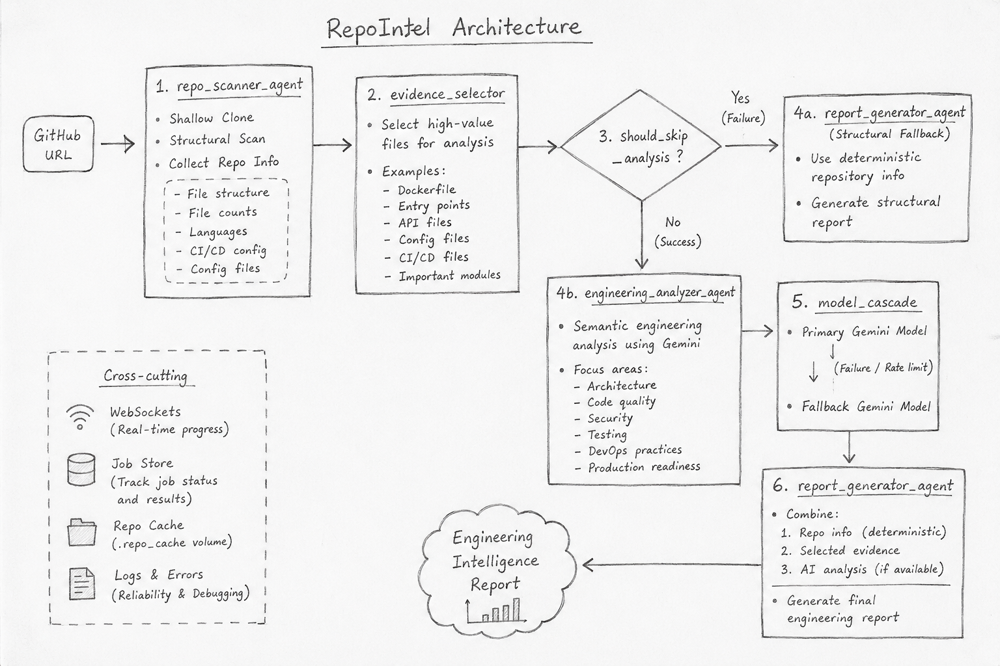

# RepoIntel

AI-powered repository intelligence for public GitHub repositories.

[Interface Demo Placeholder]

## What It Does

RepoIntel analyzes public GitHub repositories by separating deterministic repository analysis from semantic AI analysis.

Instead of sending an entire codebase directly to an LLM, RepoIntel first scans the repository, selects high-value source evidence, and then uses task-routed Gemini models to generate an engineering review.

This approach reduces unnecessary context sent to the LLM while keeping the pipeline predictable and resilient to AI API failures.

```text
GitHub URL
    ↓
Repository Scan
    ↓
Evidence Selection
    ↓
Engineering Analysis
    ↓
Model Cascade
    ↓
Engineering Intelligence Report
```

## Architecture



## How It Works

### 1. Repository Scanning

The `repo_scanner_agent` shallow-clones the target GitHub repository and performs deterministic structural analysis.

It identifies information such as:

* File structure
* File counts
* Programming languages
* CI/CD configuration
* Important project configuration files

The scanner does not require an LLM.

### 2. Evidence Selection

The `evidence_selector.py` component deterministically selects the most relevant files for semantic analysis.

Examples include:

* `Dockerfile`
* Application entry points
* API files
* Configuration files
* CI/CD files
* Important source modules

This prevents the entire repository from being unnecessarily passed to the LLM.

### 3. Conditional Routing

After repository scanning, the workflow evaluates whether semantic analysis should continue.

If the repository scan fails — for example, because the repository cannot be found — the workflow skips the AI analysis phase and proceeds directly to report generation.

```text
Repository Scan
      │
      ├── Failure → Structural Report
      │
      └── Success → Engineering Analysis
```

### 4. Engineering Analysis

The `engineering_analyzer_agent` receives the selected repository evidence and performs semantic engineering analysis using Gemini.

The analysis focuses on areas such as:

* Architecture
* Code quality
* Security
* Testing
* DevOps practices
* Production readiness

### 5. Model Cascade

RepoIntel uses a primary Gemini model for engineering analysis.

If the primary model becomes unavailable or encounters a supported failure such as a rate limit, the request can fall back to the configured fallback model.

This prevents a temporary model failure from immediately terminating the analysis.

### 6. Report Generation

The `report_generator_agent` combines:

* Deterministic repository information
* Selected evidence
* AI analysis

and produces the final engineering review.

If semantic analysis was skipped or unavailable, the system generates a deterministic structural fallback report instead.

## Architecture Flow

```text
GitHub URL
    ↓
repo_scanner_agent
    ├── shallow clone
    ├── structural scan
    └── evidence selection
    ↓
_should_skip_analysis
    ├── Failure → report_generator_agent
    │              ↓
    │       Structural Report
    │
    └── Success
           ↓
    engineering_analyzer_agent
           ↓
      Model Cascade
           ↓
    report_generator_agent
           ↓
    Engineering Report
```

## Design Decisions

### Why deterministic analysis before the LLM?

Repository structure, file counts, language detection, and configuration detection do not require an LLM.

Keeping these operations deterministic makes the system:

* More predictable
* Easier to debug
* Less dependent on external APIs
* More efficient with model context

### Why evidence selection?

Sending an entire repository to an LLM wastes context and increases processing cost.

RepoIntel therefore selects high-value files before semantic analysis so the model can focus on the parts of the repository most relevant to engineering evaluation.

### Why task-based model routing?

Not every operation requires the same model capability.

RepoIntel separates deterministic processing from semantic analysis and uses the configured Gemini models according to the task.

This avoids using expensive model reasoning for operations that can be handled deterministically.

### Why avoid a supervisor loop?

RepoIntel uses a deterministic LangGraph workflow rather than an LLM-controlled supervisor loop.

This provides a predictable execution path and avoids unnecessary iterative model calls.

The workflow is therefore easier to reason about, debug, and control.

### Why fallback behavior?

External AI APIs can fail because of:

* Rate limits
* Quota exhaustion
* Temporary availability issues
* API failures

RepoIntel therefore uses a model cascade and ultimately a deterministic structural fallback.

Even when semantic analysis cannot be completed, the system can still return useful structural information.

## Tech Stack

| Layer                       | Technology                              | Purpose                                       |
| --------------------------- | --------------------------------------- | --------------------------------------------- |
| **API Backend**             | Python, FastAPI                         | Serves the API and manages analysis jobs      |
| **Real-time Communication** | WebSockets                              | Streams pipeline progress to the client       |
| **AI Orchestration**        | LangGraph                               | Defines the deterministic analysis workflow   |
| **LLMs**                    | Gemini 3.5 Flash, Gemini 3.1 Flash Lite | Semantic repository analysis and fallback     |
| **Repository Analysis**     | Python                                  | Deterministic scanning and evidence selection |
| **Deployment**              | Docker, Docker Compose                  | Containerized deployment                      |

## Project Structure

```text
repo-intel/
├── src/
│   ├── agents/
│   │   ├── repo_scanner.py
│   │   ├── evidence_selector.py
│   │   ├── engineering_analyzer.py
│   │   └── report_generator.py
│   │
│   ├── api/
│   │   └── # FastAPI routes and WebSocket handlers
│   │
│   ├── graph/
│   │   └── workflow.py
│   │
│   └── providers/
│       └── # Gemini integrations and model cascading
│
├── frontend/
├── tests/
├── Dockerfile
├── docker-compose.yml
└── requirements.txt
```

## Verified Run

RepoIntel successfully analyzed its own repository using the V2 runtime.

* **39 files scanned**
* **2,595 lines of code**
* **15 evidence files selected**
* **31,354 evidence characters**
* **2 successful AI calls**
* **6.3/10 engineering score**
* **Analysis mode:** AI Enhanced

## Quick Start

### Requirements

* Python 3.12+
* Gemini API key

### Installation

```bash
python -m venv venv
```

#### Windows

```powershell
.\venv\Scripts\Activate.ps1
```

#### Linux / macOS

```bash
source venv/bin/activate
```

Install dependencies:

```bash
pip install -r requirements.txt
```

### Environment Variables

Create a `.env` file in the root directory:

```env
GEMINI_API_KEY=your_gemini_api_key_here
```

### Run Locally

```bash
uvicorn src.main:app --reload --host 127.0.0.1 --port 8000
```

Open:

```text
http://127.0.0.1:8000
```

## API Endpoints

| Method | Endpoint               | Purpose                                          |
| ------ | ---------------------- | ------------------------------------------------ |
| `POST` | `/api/analyze`         | Initiates an analysis job and returns a `job_id` |
| `GET`  | `/api/report/{job_id}` | Retrieves the generated report                   |

## WebSocket Behavior

RepoIntel uses WebSockets to provide real-time pipeline progress.

### Connection

```text
ws://<host>/api/ws/{job_id}
```

### Progress Event

```json
{
  "type": "progress",
  "agent": "...",
  "message": "..."
}
```

Reports stage progress and timing information.

### Error Event

```json
{
  "type": "error",
  "message": "..."
}
```

Reports analysis failures.

### Completed Event

```json
{
  "type": "completed",
  "report": "..."
}
```

Delivers the final engineering report.

## Docker Deployment

RepoIntel can be deployed using Docker Compose.

```bash
docker-compose up --build
```

The configuration also provides a local `.repo_cache` volume for repository processing.

## Environment Variables

| Variable                | Required | Purpose                                                    |
| ----------------------- | -------- | ---------------------------------------------------------- |
| `GEMINI_API_KEY`        | **Yes**  | Authentication for Google Gemini APIs                      |
| `GEMINI_MODEL_PRIMARY`  | No       | Overrides the primary Gemini model                         |
| `GEMINI_MODEL_FAST`     | No       | Overrides the fast/helper model                            |
| `GEMINI_MODEL_FALLBACK` | No       | Overrides the fallback model                               |
| `ENABLE_FAST_HELPER`    | No       | Enables or disables the optional fast classification phase |

## Failure Handling

The pipeline is designed to avoid failing silently.

### Primary Model Failure

The engineering analysis can fall back to the configured fallback Gemini model when the primary model encounters a supported failure.

### Total AI Failure

If the configured AI models are unavailable, RepoIntel generates a deterministic structural report containing information such as:

* File counts
* Programming languages
* Configuration information
* CI/CD presence
* Basic repository health information

### Repository Failure

If the target repository cannot be cloned or scanned successfully, the workflow skips semantic analysis and proceeds to structural report generation.

## Limitations

* Currently supports public GitHub repositories.
* Shallow cloning limits deep historical analysis such as commit history and contributor velocity.
* The system relies on static repository analysis and AI interpretation.
* It does not compile or execute the analyzed repository.
* It does not perform dynamic security testing.

## Future Improvements

* GitLab and Bitbucket repository support
* Streaming final LLM output through WebSockets
* Deeper repository analysis
* Additional repository security analysis
* Expanded automated evaluation of generated engineering reports

## License

This project is licensed under the MIT License.
