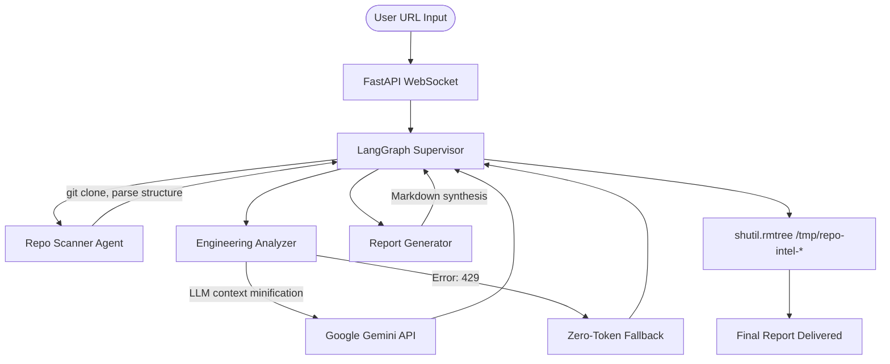

# RepoIntel

An AI-Powered GitHub Repository Analysis Agent built with **LangGraph** and **FastAPI** that acts as an automated Staff Engineer.
It ingests a public GitHub repository, orchestrates multiple specialized AI agents to analyze code quality, security, and DevOps maturity, and streams real-time insights back to the client via WebSockets.

## 🚀 Key Features

* **Multi-Agent Orchestration**: Utilizes a LangGraph Supervisor pattern to coordinate specialized agents (Engineering Analyzer, Repository Scanner).
* **Resilient Infrastructure**: Implements exponential backoff, API key rotation, and a deterministic zero-token fallback engine to survive rate-limit exhaustion.
* **Payload Minification**: Uses a lightweight preprocessor to remove blank lines and trailing whitespace before selected code/configuration content is sent to the LLM.
* **Real-time Event Streaming**: Streams status updates to the client via asynchronous WebSockets.

---

## 🛠️ Technology Stack

- **Orchestration**: LangGraph, LangChain
- **Backend API**: FastAPI, Uvicorn, Python `asyncio`
- **Real-time Comms**: WebSockets
- **LLM Provider**: Google Gemini (gemini-2.5-flash)

## Architecture



## Tech Stack
- **AI Orchestration**: LangGraph, LangChain
- **LLM**: Google Gemini API (`gemini-2.5-flash`)
- **Backend**: FastAPI, WebSockets
- **Frontend**: HTML5, CSS3, Vanilla JS

## Getting Started

1. Clone the repository and navigate to it:
   ```bash
   git clone https://github.com/pepi-code-srt/repo-intel.git
   cd repo-intel
   ```

2. Create and activate a virtual environment:
   ```bash
   python -m venv venv
   # On Windows:
   .\venv\Scripts\activate
   # On Mac/Linux:
   source venv/bin/activate
   ```

3. Install dependencies:
   ```bash
   pip install -r requirements.txt
   ```

4. Set up your environment variables:
   ```bash
   cp .env.example .env
   ```
   *Edit `.env` and add your Google Gemini API key.*

5. Run the server:
   ```bash
   uvicorn src.main:app --reload
   ```

6. Open your browser to `http://localhost:8000` and paste a GitHub URL!

## Evaluation / Benchmarks

We have conducted strict resilience and benchmark testing. All testing scripts are available in `scripts/` and full results are in `evidence/reports/BENCHMARK_REPORT.md`.

* **End-to-End Analysis**: During a local Windows 11 test on 2026-07-15, two public repositories completed the end-to-end workflow in deterministic fallback mode. Observed wall-clock durations were 6.50s and 7.25s, with 7 WebSocket events captured for each run.
* **Payload Minification**: In one synthetic whitespace-heavy code sample, the production minifier removed blank lines and trailing whitespace, reducing the character count from 86 to 53 (**38.37%**).
* **Graceful Degradation**: If the API key is exhausted or invalid, the system automatically falls back to a deterministic 0-token report generator, successfully streaming the completion event without crashing. (Verified via isolated mock tests and E2E runs).

## Limitations
- **Public Repositories Only**: Currently relies on unauthenticated `git clone`, so it cannot analyze private repositories.
- **Large Repositories**: Large monorepos may still hit context limits if they contain too many massive files.

## Future Improvements
- Integrate GitHub OAuth for private repository scanning.
- Replace in-memory `jobs` dictionary with Redis for horizontal scalability.
